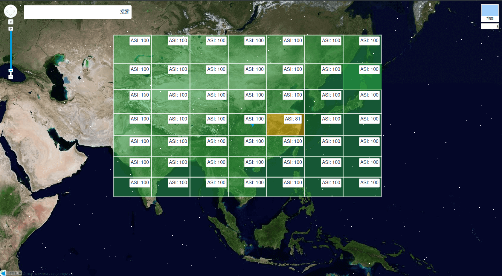
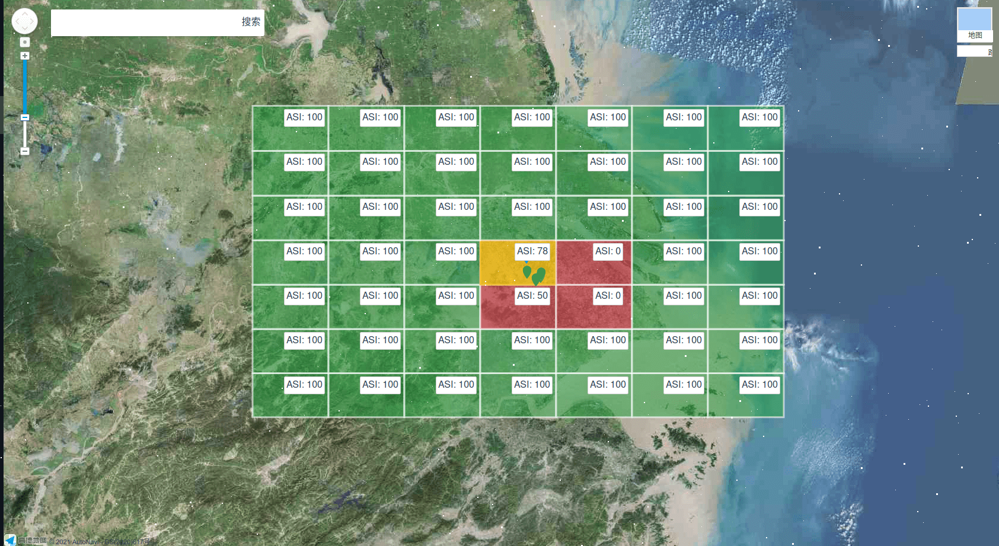
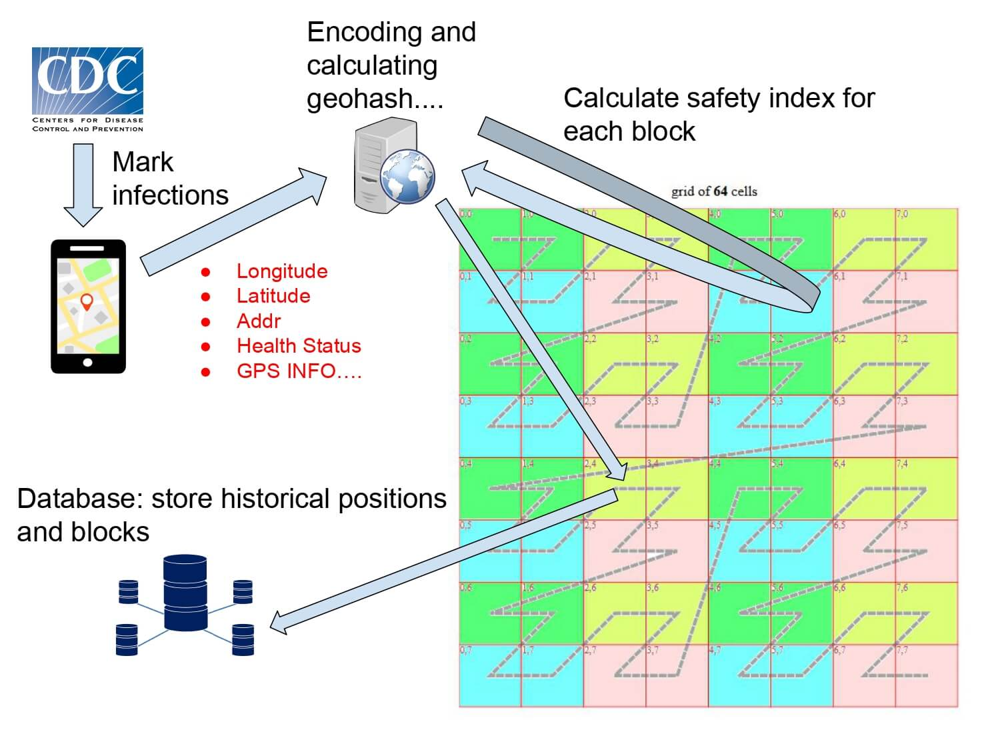
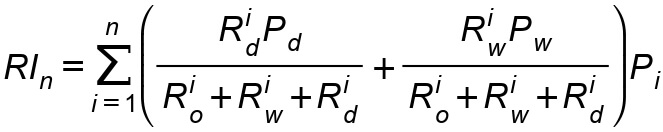

# 论文中亟待解决的问题

论文 Section 4.4 block quantification 说服力低。

问题描述：

我们提出了一种通过 GeoHash 方法动态划分地理区块，然后对区块进行新冠疫情特征的一些量化分析的方法，使疫情防控可以更有效的
在 GIS（geographic information system）上进行，也可以动态缩放观察的范围，做到更灵活更精确的疫情追踪。但是区块量化分析的
算法没有经过医学“考验”，我项目成员均无传染病研究背景，目前系统采用的算法是基于感染和疑似感染的人口密度进行风险评估的。

我们已经完成了从客户端采集用户的数据，到地理区块记载用户数据，区块安全指数量化分析的工作。但最后一步量化安全指数以确定区
块属于“低中高”风险区。

通过 GIS 我们获得一个区块 Block 如下的一些数据

-   Rd 高风险，已确诊人数
-   Rw 风险，接触或去过其他风险区块的人数
-   Ro 无风险人数
-   Rd+Rw+Ro=区块总人数
-   INd 区块当日输入感染人数
-   INw 区块当日输入接触人数
-   INo 区块当日输入无风险人数
-   Bs 区块面积
-   以上所有变量可以获取历史记录，n 天。例如新冠是 14 天

目标结果：ASI(Area Safety Index) 地区安全指数，下图中有公式，是我们当前采用的算法。

其他可控系数：Pd, Pw, Pi，分别表示感染者影响权重，接触者影响权重，时间影响权重（按天算）。

以上使用的所有变量都是我们自己总结的，有缺少或多余都可以调整。可控系数可以在系统中设置。

我们力所能及的部分主要是 GeoHash 编码和划块算法的研究，以及对区块信息进行分析的方法。

请求获得可靠的传染病医学支撑，诚邀有意者加入我们的 paper。我们的 paper 将会向计算机领域的国际期刊或会议投递，所有参与者
均有署名。

优势(论文中已经描述)，大致列一下：

1. 用户通过 GIS 软件确定风险地区，提供出行建议
2. 采集的用户数据用于 ASI 更精确的计算
3. 防控更有灵活性，可以根据疫情扩散的范围控制 block 范围，调整防控的范围
4. 观察者可以集中精力研究重点的几个区块
5. 观察者，用户通过 GIS 信息互传，获取 news 更便捷和快速，做到实时性
6. 这种 GIS 可以运用在其他转染病，甚至是其他社会问题研究和追踪：例如犯罪，地震等

基于这套 GIS 项目，我们还有其他正在准备的论文，技术均已申请专利，其中第二篇仍然需要与医学领域紧密结合

-   Epidemic Prevention and Control Based On GeoHash
-   蓝牙社交网络与疫情追踪
-   基于“泛基站”的人口特征分析
-   “Population Accounting” on GeoHash Blockchain
-   Personal Health and Insurance Identification

## 图例：

## 目前采用的算法

## 参考资源文件

[论文草稿](./geohash.pdf)

[专利](./geohash.docx)
