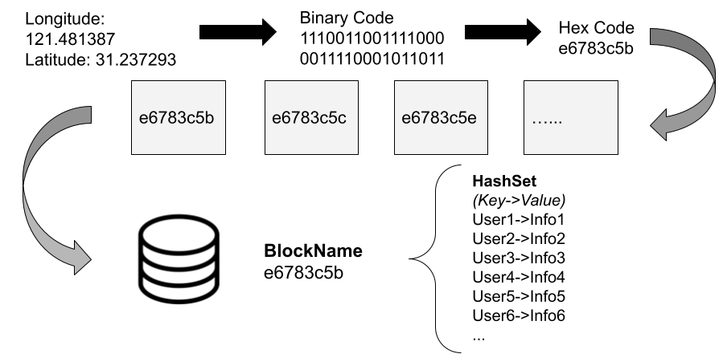

**_未写入 latex 正式论文中的临时内容_**

# Geohash temporary document for paper exchange

## GeoHash bit explanation

The GeoHash bit is divided into two parts, the first half part encodes longitude, the second half part encodes the
latitude.

## 4.3 Block Storage

We store all these blocks and user data in common databases on the server. Considering that in the real engineering
environment, data storage includes two parts:

-   user geographic location data
-   block data

Logically speaking, one block contains many users, and one user has many position logs. Block and user information are
bidirectional associated, which is called “many to many” in the field of computer storage. This section will discuss the
stored data models and algorithms.



### 4.3.1 Position to GeoHash Bit

Before storing the block, we have to first encode the position by GeoHash. Referring to the method of grid division in
Section 4.1, we adopt the following algorithm.

```js
function geohash(latitude, longitude, bit) {
    let res = ''
    let lat = []
    let lon = []

    // limitation of longitude and latitude
    lat[0] = -90.0
    lat[1] = 90.0
    lon[0] = -180.0
    lon[1] = 180.0

    if (latitude < lat[0] || latitude > lat[1] || longitude < lon[0] || longitude > lon[1])
        throw new Error('Invalid longitude or latitude')

    let len = bit * 2
    while (res.length < len) {
        // add longitude geohash bit
        let mid = (lon[0] + lon[1]) / 2
        if (mid > longitude) {
            res += '0'
            lon[1] = mid
        } else {
            res += '1'
            lon[0] = mid
        }
        // add latitude geohash bit
        mid = (lat[0] + lat[1]) / 2
        if (mid > latitude) {
            res += '0'
            lat[1] = mid
        } else {
            res += '1'
            lat[0] = mid
        }
    }
    return res
}
```

In the section 4.1 we have discussed that a GeoHash binary code can be divided into two parts: longitude part and
latitude part, and they have the same number of bits. In this function, the difference is that longitude and latitude
are rankded one by one. For example: in a returned GeoHash binary code, the first bit represents the range of longitude,
then the second bit represents the range of latitude, and the third bit is longitude again, and so on. This is for code
simplicity, theoretically, as long as the encoding and decoding rules are consistent, how to sort GeoHash binary codes
is not the most important thing here.

### 4.3.2 GeoHash Bit to Hex

If we directly save the GeoHash binary code of a block, a string of binary code is too long. In the actual production
environment, we convert binary code to hexadecimal code and store the "hex code" in **Redis**. Therefore, a string of
hex code represents one block, and also represents a set of positions. Figure x shows the complete process of "From
position to GeoHash hex code".

The advantage of using hex code is that when the position needs to be determined, hex code can be easily converted to
binary code, and then the binary code can be decoded to the range of latitude and longitude by GeoHash algorithms. The
accuracy of the restored position depends on the number of GeoHash bits. In this project, we choose 10-20 bits GeoHash
to encode longitude and latitude respectively, so the total length of a generated GeoHash binary is 20-40 bits. In the
practical test, we consider such sizes of block are the most reasonable observation range for medical workers.

## 4.3.3 Block Storage

Figure x has illustrated the storage data structure in Redis. Redis Hashes are maps between string keys and string
values. We set the user IDs as keys and user health information as values in a hash table. In the database, one block
corresponds to one hash table and the hexadecimal code of block is the name of hash table.

In this way, when a user enters a block, the hash table of the block will save the user's ID and information as a
"key-value" pair. When the user enters another block, the user will be moved out of the current hash table and into the
hash table corresponding to the new block.

It is worth to note that for the blocks that there are no user in it, we call them "depopulated blocks". These blocks
are logically existed, but they are not physically stored. Thus we free the storage space by clearing the "depopulated
blocks". In contrast, when the first user appears in a "depopulated block", a new block will be created dynamically, a
corresponding hash table will be generated, and the user's information is stored.

For the blocks that the user has entered over a period of time, the logs are recorded at row level in a relational
database. The users' IDs are the foreign keys in the table.

Based on the above storage mode, we also have a "user table". The primary key is the user's ID, and the table is used to
save the user's basic information.

## Grid Quantification

下面开始介绍量化区块安全信息
